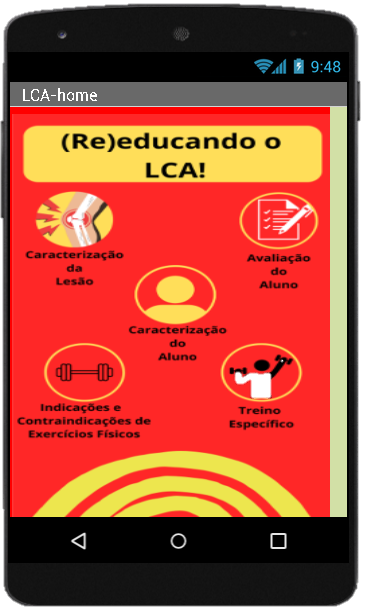
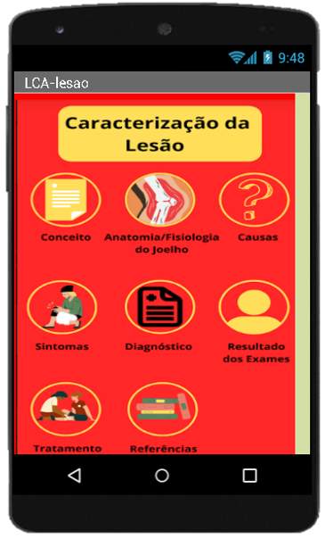
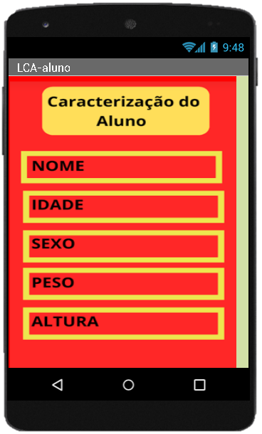
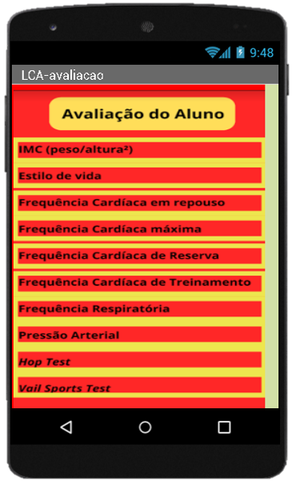
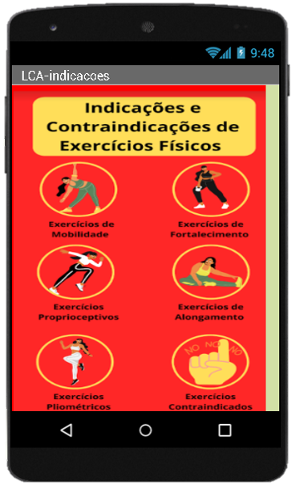
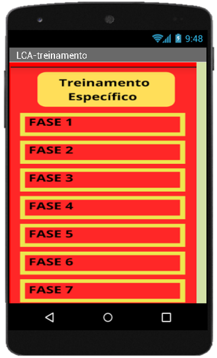

# Projeto Reabilitação e (Re)educação do LCA

## Funcionalidades do aplicativo

O [aplicativo LCA para Android](src/LCA.apk) foi projetado com as seguintes funcionalidades:

1. Caracterizão da lesão
2. Caracterizão do aluno
3. Avaliação do aluno
4. Indicações e contraindicações de exercícios físicos
5. Treinamento específico

## Código-fonte
O aplicativo está disponível para descarga na pasta [src](src/)
ou escaneando o QR code:

## Screenshots

